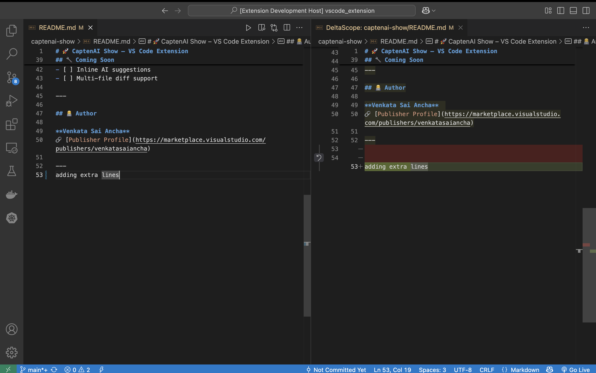

# DeltaScope

DeltaScope is a lightweight and intuitive VS Code extension that **automatically shows Git diffs beside the editor when you save a file** — no clicks, no shortcuts, just code → save → see changes.

> Built with ❤️ by [avs.ai](https://avsai24.github.io/avsai_portfolio/)

---

## ✨ Features

- 💾 Auto-triggered Git diffs on file save
- 🔁 Max 3 diffs open at a time (auto-closes oldest)
- 🧠 Prevents duplicate diff tabs for the same file
- 🚀 Opens side-by-side using native VS Code diff viewer
- 🧹 Temp file cleanup via `tmp` (no junk left behind)

---

## 🚀 How It Works

Just open any Git-tracked file, make a change, and hit **Save**.  
DeltaScope will:
1. Grab the last committed version from Git
2. Create a temporary file
3. Open a side-by-side diff showing the before & after

---

## 📷 Screenshots

You can add screenshots or GIFs like this:

---

## 🧰 Requirements

- Your project must be a **Git repository**
- Works best on files that have been **committed at least once**

---

## ⚙️ Extension Settings

_No user settings yet — simple and opinionated by design._

Future versions may support:
- `deltascope.maxOpenDiffs`
- Custom diff titles

---

## 🐞 Known Issues

- Doesn't show diffs for **untracked or uncommitted** files
- Diff focusing behavior may vary depending on VS Code version

---

## 📝 Release Notes

### 1.0.0
- Initial release with Git diff on save, 3-tab limit, and duplicate prevention

---

## 💡 Inspiration & Guidelines

Built using best practices from:

- [VS Code Extension Guidelines](https://code.visualstudio.com/api/references/extension-guidelines)
- [VSCE Publishing Guide](https://code.visualstudio.com/api/working-with-extensions/publishing-extension)

---

## 🙌 Contributing

Found a bug? Want to suggest a feature?  
Open an issue or PR at: [https://github.com/avsai24/DeltaScope/issues](https://github.com/avsai24/DeltaScope/issues)

---

## 📄 License

MIT © [avs.ai](https://avsai24.github.io/avsai_portfolio/)